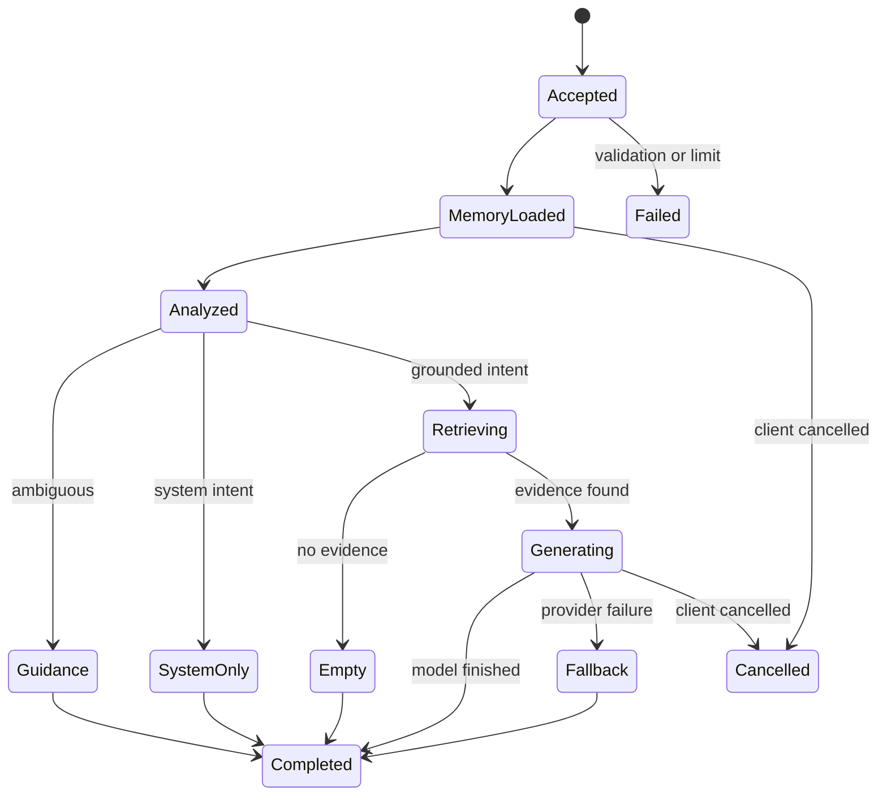

# Architecture

> Draft status: this architecture is a working decision map, not an implementation handoff, until the Wayfinder official-documentation research gate is closed.

## System Shape

```text
Vite SPA + assistant-ui LangChain v2 runtime
            |
            | @assistant-ui/react-langchain/useStreamRuntime
            v
Same-origin gateway (/api/agent)
            |
            | Agent Protocol v2 SSE + commands through the official SDK transport
            v
Aegra + Python LangGraph Server/Workers
            |
            v
Python StateGraph / Chat orchestrator
  | memory  | rewrite/split | intent/slot analysis
  | strategy-based + Qdrant retrieval | grounding + safety
  | external model stream
            |
Postgres / Redis / TaskIQ / Qdrant / Object Storage / FastAPI domain API
        |
        | structured logs + metrics + health checks
        v
  Application diagnostics

Aegra graph/LLM official Langfuse integration (scrubbed, fail-open)
        |
        v
  Langfuse (sole AI/RAG Trace backend)

PostgreSQL business run records / audit events
        |
        | run_id + optional langfuse_trace_id correlation
        v
  Business state and operator detail
```

The canonical Compose entrypoint is the repository-root `docker-compose.yml`. Its `dev`, `test`, and `prod` profiles select environment-specific resource, logging, metrics, and Langfuse settings without adding a separate tracing stack or changing the application-owned service boundaries. External generation, embedding, reranking, and MinerU APIs remain configured providers rather than local Compose model services.

The high-level seam is the chat orchestrator. A caller supplies a question, conversation context, model preferences, and an authenticated actor. It receives a structured answer result or typed streaming events. The orchestrator's interface includes ordering constraints, short-circuit outcomes, error semantics, cancellation behavior, and evidence invariants; it is more than a Python protocol declaration.

Production generation, embedding, reranking, and MinerU extraction are external API providers. The target does not deploy Ollama or any other local model server. Deterministic fakes and an evidence-insufficiency result are test/degradation mechanisms, not production model providers.

## Modules And Interfaces

### Chat Orchestrator

The orchestrator owns one request's state machine. It loads memory, rewrites the question, splits only explicit multi-question input, resolves the dynamic intent tree, extracts intent-specific slots, detects ambiguity, runs configured retrieval strategies, assembles grounded context, applies safety policy, selects a model, persists messages, records business run events, and emits events. Aegra's official Langfuse integration records the redacted AI/RAG observations for the hosted graph; the application does not create a second Trace runtime.

The implementation is allowed to compose internal modules, but callers do not need to know those internal stages. This gives tests leverage and keeps provider changes local.

### Intent Resolver

The resolver mirrors Ragent's dynamic intent tree. It loads enabled nodes from PostgreSQL through a Redis cache, flattens the tree to eligible leaf nodes, and asks the configured LLM to score only those known node ids. The parser drops unknown ids, sorts candidates by score, applies the configured top-N and threshold policy, and preserves the node kind used for routing. A separate ambiguity service compares the leading candidates and either confirms the route or returns bounded user guidance. Intent-specific slot extraction is performed only after a route is selected.

### Hybrid Retriever

The retriever accepts one or more Ragent-style sub-question intents and returns evidence grouped by intent. Retrieval strategies are selected by the resolved node configuration; MedicalRAG uses Qdrant dense and sparse/BM25 Hybrid Retrieval plus authorization-scoped exact/structured PostgreSQL filtering without introducing a second vector, search, or graph platform. Qdrant's built-in RRF ranker combines the dense and sparse candidate lists; application-level Evidence Fusion then applies provenance, policy, quotas, and external Reranker scores. Qdrant collections are selected by immutable Embedding Schema Version and contain only eligible Published Versions.

### Model Router

The router accepts capability requirements and a route policy. It returns an external model API adapter that can stream text and report cancellation. Candidates are ordered by priority. Timeouts and transient errors advance to the next candidate. A Redis-backed circuit protects unhealthy candidates through closed, open, and half-open states. No local model server is a routing candidate.

### Durable Application Messaging

TaskIQ executes durable asynchronous application workflows that are separate from Aegra's agent runtime. Ingestion, extraction, embedding, indexing, and operational event jobs use stable job ids, worker-side retries, bounded `job_timeout`, and idempotency records or unique business constraints. Where the source behavior requires publication to be coupled to a local business outcome, the worker writes a job row to the PostgreSQL transactional outbox inside the same transaction as the state change, and an outbox relay enqueues it to TaskIQ only after commit. Jobs that exhaust retries leave the Ingestion Run in a terminal failure state and are listed on the operator failure/review surface for bounded replay. PostgreSQL remains the durable business source of truth.

### Memory

The memory interface loads a bounded recent window and stores user/assistant messages. When the window is exceeded, older turns are summarized into a durable conversation summary. User ownership is part of every memory call.

### AI/RAG Observability And Business Run Records

Aegra's official Langfuse integration is the only AI/RAG Trace backend. It records redacted graph/LLM observations such as operation names, model/provider versions, counts, status, latency, token usage where available, and safe error classes. The integration may use OpenTelemetry internally as an Aegra implementation detail, but MedicalRAG does not add OpenTelemetry SDKs, OTLP exporters, a Collector, Tempo, Grafana, manual spans, or a second Langfuse callback/exporter.

PostgreSQL stores durable `chat_runs`, `ingestion_runs`, and `run_events` for product status, audit, policy versions, counts, failure codes, actor/workspace scope, and optional `langfuse_trace_id` correlation. `run_id` is the business source-of-truth identifier; a Langfuse trace is observability data and cannot be the business primary key. The operator UI reads business lifecycle detail from PostgreSQL and opens the Langfuse trace for AI/RAG details.

`packages/infra` owns business run/audit repositories, structured logging, metrics, health adapters, and ordinary provider/storage adapters. It must not contain an application-wide tracing provider or custom span tree. API and Worker diagnostics carry safe `request_id`/`run_id` fields in structured logs and metrics; raw prompts, document text, evidence text, patient identifiers, credentials, cookies, and authorization headers are never emitted.

No second LangChain/LangGraph Langfuse callback or exporter is added for the same Aegra-hosted invocation. Aegra is the sole Langfuse ingestion owner, and Langfuse export is fail-open: an unavailable endpoint only reduces observability and never blocks a chat answer, ingestion transition, message acknowledgement, or business-state persistence.

### Python LangGraph and LangChain Runtime

The graph is implemented with Python LangGraph's Graph API (`StateGraph`). LangChain supplies model/provider adapters, prompts, structured output, tools, and retrieval primitives inside graph nodes; it does not own the top-level workflow. The graph follows Ragent's controlled pipeline: memory, rewrite/split, intent resolution, short-circuit routing, bounded sub-question fan-out, Qdrant Hybrid Retrieval, rerank/fusion, grounding, and streamed generation. The root is not LangChain `create_agent`, because Ragent does not require an open-ended ReAct loop. Aegra owns the graph's official Langfuse integration; the application must not add a second Langfuse CallbackHandler or exporter for the same graph/LLM invocation.

### Aegra Agent Runtime

Aegra is mandatory in production and is consumed through its native Agent Protocol v2 implementation. The browser uses assistant-ui's official `@assistant-ui/react-langchain` `useStreamRuntime`, which wraps `@langchain/react` v1 `useStream` and the `@langchain/langgraph-sdk` `ThreadStream` SSE transport. The stock runtime owns v2 command envelopes, SSE decoding, content-block assembly, channel subscriptions, hydration, reconnect/since handling, cancellation, and interrupt resume; the application does not implement a runtime, protocol bridge, SSE parser, or message reducer. A same-origin `/api/agent` route proxies the v2 endpoints and preserves the existing system session. The application still maps PostgreSQL Conversations to Aegra `thread_id` values and may provide the official remote thread-list adapter for conversation browsing. Python `langgraph-sdk` remains available for server-side integration and contract tests. Aegra owns checkpoints, leases, recovery, and Agent Protocol stream state; TaskIQ executes durable domain workflows but does not own Thread/Run state or browser streaming. Medical domain rules remain in the server-side graph and application services, not in the frontend or in Aegra's persistence layer. MCP compatibility and MCP parameter extraction are outside the target boundary.

### Python Package Boundary

The Python monorepo contains `packages/medical-core`, `packages/infra`, and `packages/contracts`. `medical-core` is the domain seam — entities, state machines, policies, ports, and deterministic domain services — and carries no LangGraph/Aegra/FastAPI dependencies; the LangGraph `StateGraph` assembly and Aegra binding live in `apps/agent`. `infra` owns concrete PostgreSQL, Redis, Qdrant, TaskIQ, object-storage, external-provider, business run/audit repositories, structured logging, metrics, and health adapters. `contracts` owns the OpenAPI-generated `/api` TypeScript types (with `/api/agent` pinned to Agent Protocol v2, ADR 0071) plus the cross-process event envelope. Aegra owns its graph/LLM Langfuse integration. `apps/api`, `apps/agent`, `apps/worker`, and isolated `apps/evaluation` each own their own composition/runner boundary and import only the packages they need. `infra` is deliberately not nested under `apps/api`, because Agent and Worker need the same adapters and must not import an API application package. The repository-level `infra/` directory remains deployment configuration for Compose; `packages/infra/` is the installable Python adapter package.

## Chat State Machine



Every terminal state persists a user message, an assistant outcome or error event, and business run completion. Aegra closes the associated Langfuse observation when one exists; Guidance and empty-retrieval outcomes are not model failures.

## Data Model

The durable model separates user-owned conversation data from shared medical knowledge:

- Identity: users, sessions, roles.
- Conversation: conversations, messages, summaries, feedback.
- Knowledge: knowledge bases, documents, chunks, document ingestion runs, ingestion nodes.
- Intent and retrieval behavior: intent-tree nodes, query-term mappings, slot schemas, model targets, model health snapshots.
- Business operations and audit: chat runs, ingestion runs, run events, safe event payloads, and optional Langfuse trace correlation ids.

Intent nodes and slot schemas are versioned and owned by the application. Document chunks carry source metadata, heading context, checksums, and embedding/index metadata; actual dense and sparse representations are owned by Qdrant. All user-owned records have an owner id or an explicit operator access rule.

## Runtime And Failure Policy

- PostgreSQL, Redis, Qdrant, object storage, Aegra, and the TaskIQ Worker are required production dependencies; isolated in-memory adapters exist only for deterministic tests.
- Redis is required for authentication sessions, distributed rate limits, queue coordination, and pub/sub. A local fallback is explicit and emits a degraded health state.
- External model APIs are required for production generation. Provider outage returns a deterministic evidence-insufficiency result after routing/failover; the system does not start a local model service.
- Langfuse export is fail-open: an unavailable endpoint marks AI/RAG observability degraded and never fails an Agent run, domain state transition, TaskIQ job acknowledgement, or PostgreSQL business run/audit persistence. Structured logs, metrics, and health checks remain available independently.
- An unavailable MinerU API marks one ingestion node failed while preserving the task and its prior node logs; TaskIQ worker retry and compensation remain idempotent.
- An unavailable Redis transport delays TaskIQ job delivery and exposes a degraded readiness state; PostgreSQL preserves retryable application state so pending and in-flight jobs recover from the outbox after Redis returns. Redis is the delivery mechanism, not a durable message log; durability comes from PostgreSQL, and there is no silent fallback to an alternative broker.
- A missing slot skips only the dependent route action and leaves other sub-question intents active.
- An ambiguous intent returns a clarification message without calling the model or mutating retrieval state.
- A model error advances through the routing policy, then returns a safe grounded fallback if every candidate fails.

## Testing Seams

The primary seam is the orchestrator interface. It is tested with in-memory adapters and asserts externally observable result state, evidence, safety flags, events, persistence calls, business run completion, and correlation metadata. The HTTP seam wraps this behavior with authentication, validation, serialization, and SSE framing tests. Database, Redis, Aegra, business run/audit repositories, Langfuse export, and ordinary observability adapters have focused contract tests. Langfuse tests assert observation metadata, medical-content redaction, sampling, and fail-open behavior; structured-log and metrics tests assert safe correlation fields. PostgreSQL tests assert durable business run/audit semantics independently of Langfuse availability. Their internal query construction is not the primary behavior test.
