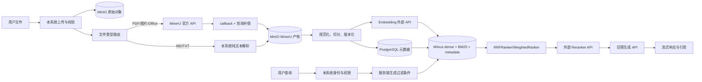

# 检索、摄取与存储：官方文档研究

## 研究边界

- **研究日期**：2026-07-26。
- **研究目标**：为本项目确定 Milvus/PyMilvus 检索、MinerU 文档摄取、MinIO/S3-compatible 对象存储及外部 API 数据边界的可落地方案。
- **本文件性质**：研究结论与设计建议，不包含实现代码，不修改项目规范、架构、ADR 或 Wayfinder 票据。
- **资料限制**：本文引用的事实只来自 Milvus/PyMilvus、MinerU、MinIO 或 AWS S3 的官方文档/官方仓库。AWS 文档仅用于说明 S3 协议语义；MinIO 是否实现某项 S3 API，仍以 MinIO 官方兼容性清单为准。

> **计划变更（2026-08-01）对账说明**：本文是历史调研快照，正文保留原始记录。检索与存储的既定决策已随以下变更对账：
> - **检索存储轴（2026-08-04）**：唯一检索引擎已由 Milvus 替换为 **Qdrant** 单容器（dense + fastembed 静态 sparse/BM25 + 内置 RRF k=60），Compose 移除 MinIO 与 etcd，见 [ADR 0075](../adr/0075-qdrant-replaces-milvus-as-the-hybrid-retrieval-engine.md)。本文 Milvus/MinIO 正文为历史参考。
> - **Milvus ranker API**：2.6+/3.0 官方推荐的混合检索 ranker 由旧式 `RRFRanker`/`WeightedRanker` 类迁移到新式 `Function/FunctionType` RERANK（本文默认 RRFRanker 属 2.5 风格；实现时按所选服务端版本选 API），详见 [tech-stack-objective-evaluation](tech-stack-objective-evaluation.md) §2.1。
> - **MinIO 停维**：社区版已进入维护停止，Compose 钉 AGPL 最后版（`RELEASE.2025-10-15T17-29-55Z` / `RELEASE.2025-09-07T16-13-09Z`），见 [ADR 0017](../adr/0017-s3-compatible-object-storage-with-minio.md)。此决策已被 ADR 0075 取代。
> - **摄取管线承载**：异步摄取/摄取后处理由 TaskIQ + PostgreSQL 事务性 Outbox 承载（[ADR 0063](../adr/0063-arq-replaces-rocketmq-as-the-durable-job-queue.md)、[ADR 0073](../adr/0073-taskiq-replaces-arq-as-the-durable-job-queue.md)），本文存储边界不受影响。

本文逐条使用以下标记：

- **官方事实**：来源页面明确描述的能力、限制、接口或行为。
- **本项目设计建议**：基于官方能力、数据隔离要求和本项目场景作出的方案选择；不是供应商承诺，实施时必须通过测试和版本锁定验证。
- **版本 caveat**：官方文档、SDK 或 API 行为可能随版本变化，不能把当前页面的默认值当成永久契约。

## 结论摘要

### 官方事实

1. Milvus 的 Full Text Search 可由 `VARCHAR` 原文、Analyzer 和 `FunctionType.BM25` 函数组合生成 BM25 稀疏表示；插入时提供原文，查询时可以直接提供原始查询文本，客户端不必自行生成 BM25 sparse vector。[M1]
2. Milvus 的 Hybrid Search 通过多个 `AnnSearchRequest` 同时搜索不同向量字段，再用 `WeightedRanker` 或 `RRFRanker` 融合结果；每个请求可以使用自己的搜索参数和过滤条件。[M2][M3][M4]
3. Milvus 当前官方 schema 文档说明一个 collection 最多支持四个向量字段；Hybrid Search 前需要为相关向量字段建立索引并加载 collection。[M5][M6]
4. Milvus 提供 Strong、Bounded Staleness、Session、Eventually 四种一致性级别，默认是 Bounded Staleness；官方建议功能测试使用 Strong consistency。[M7]
5. MinerU 精准解析 API 使用 URL 输入，不是直接文件上传接口；批量本地文件流程是先申请上传 URL，再上传文件，上传完成后由服务端提交解析。API 文档当前列出 PDF、图片、Doc/Docx、Ppt/Pptx、Xls/Xlsx 等类型，但不把 `.md`、`.txt` 列为该 API 的支持类型。[N1]
6. MinerU 支持轮询任务状态，也支持 callback；callback 使用 `seed` 与校验值，服务端收到非 HTTP 200 时最多重复推送 5 次。[N1]
7. MinIO 提供 S3-compatible API，但官方兼容性页面明确列出部分不支持或有差异的 API，因此不能把 AWS S3 的全部能力直接假定为 MinIO 能力。[S1]
8. S3 presigned URL 是带时限的授权，权限继承签发者；Multipart Upload 可独立重传失败的 part；对象校验应使用显式 checksum，而不能把 multipart 对象的 ETag 普遍当作内容 MD5。[S2][S3][S4]

### 本项目设计建议

1. 使用 Milvus 的一个 collection 表达一个稳定的 **embedding schema 版本**：dense 模型、维度、metric、BM25 Analyzer 和 chunk 规则一旦改变，创建新版本 collection 并重新摄取，不在原 collection 中混用。
2. 以一条 chunk 同时保存原文、dense vector、BM25 生成字段和用于权限/发布版本过滤的 scalar metadata。Milvus 负责 dense + BM25 的候选融合；外部 reranker 只处理有限候选集。
3. 默认从 `RRFRanker` 开始；只有离线评测证明 dense 与 BM25 的相对贡献稳定时，才切换到经校准的 `WeightedRanker`。
4. 每个 Hybrid Search 子请求都由服务端生成相同的 workspace、knowledge base、publication version、visibility 和 deletion 过滤条件；不接受客户端任意 filter 字符串，也不依赖检索后再过滤来实现租户隔离。
5. PDF、图片和 Office 文件走 MinerU；`.md`、`.txt` 走本系统纯文本摄取路径。MinerU callback 作为主完成通知，轮询作为丢回调和超时补偿；所有回调、提交、下载和外部模型调用都设计为可重试、可去重、可审计。
6. 原始文件和 MinerU 产物进入 MinIO/S3-compatible 存储；外部 API 不获得长期对象存储凭据，只接收短期 presigned URL 或 MinerU 官方上传 URL。浏览器不直接调用 MinerU、Embedding、Reranker 或 LLM 外部 API。
7. 备份按业务一致性单元协调 PostgreSQL 元数据、MinIO 对象、Milvus collection/schema/index 以及模型和 Analyzer manifest；不能只备份某一层。

## 1. 端到端边界与职责

### 本项目设计建议

### 本项目设计建议：职责边界

| 组件 | 应承担的职责 | 不应承担的职责 |
|---|---|---|
| PostgreSQL | 文档、摄取运行、任务状态、版本、权限映射、对象 key、checksum、模型 manifest、审计状态 | 承担大段检索文本或向量 ANN |
| MinIO/S3-compatible | 原始文件、MinerU ZIP、Markdown/JSON、图片资产、失败样本和备份对象 | 直接充当权限判断来源 |
| MinerU | PDF、扫描图片、复杂多模态 PDF、Doc/Docx、Ppt/Pptx、Xls/Xlsx 的外部解析 | `.md`、`.txt` 的强制解析；业务权限；最终 chunk 版本发布 |
| Milvus | dense、BM25 Full Text Search、Hybrid Search、候选排序、标量过滤 | 业务身份认证、复杂审计、原始文件归档 |
| 外部 Embedding API | 将规定版本的文本转为 dense embedding | 接收未切分原始文档或权限元数据之外的敏感信息 |
| 外部 Reranker API | 对 Milvus 返回的有限候选进行二次相关性排序 | 决定租户可见范围；接收全部文档库 |
| 外部 LLM API | 使用查询和已授权的候选上下文生成答案 | 自行检索未授权数据；保存本系统长期状态 |

### 外部事实与本项目边界的区别

**官方事实**：MinerU 的 URL 解析接口需要将可访问的文件 URL 交给 MinerU；S3 presigned URL 的权限和有效期由签发方式决定。[N1][S2]

**本项目设计建议**：因此系统需要在生成 URL 前做数据出境/外部处理策略判断；URL 应限制有效期、对象范围和方法，且不得把 MinIO root 或长期 access key/secret key 放进外部请求。外部 provider 的数据留存、地区、训练用途、限额、日志和合规承诺不能由 Milvus、MinerU 或 S3 文档推导，必须逐 provider 阅读官方条款和 API 文档后再定稿。

## 2. Milvus/PyMilvus 能力边界

### 2.1 Collection、schema 与字段

#### 官方事实

- Milvus collection 由 schema 描述；schema 可以包含主键、标量字段和向量字段。官方 schema 文档涵盖 `VARCHAR`、数值、布尔、JSON、数组以及 dense/sparse vector 等字段类型。[M5]
- 向量字段需要与所使用的向量类型和维度相匹配。`FLOAT_VECTOR` 是 dense vector 的常用字段；`SPARSE_FLOAT_VECTOR` 用于稀疏向量。[M5][M8]
- 当前 schema 文档说明一个 collection 最多包含四个向量字段。这个限制属于版本相关的服务能力，不应仅凭客户端类型推断。[M5]
- 主键可以使用官方支持的主键类型；是否自动生成主键由 schema 选择。自动主键会减少客户端分配工作，但会削弱以业务稳定 ID 做幂等和追踪的便利性，这一取舍需要由项目决定。[M5]
- Milvus 可以启用 dynamic field。dynamic field 适合不可预先定义的附加属性，但查询、过滤和数据治理所依赖的字段应有显式 schema 字段，以便做类型、长度和版本控制。[M5]

#### 本项目设计建议：基础 schema

下表是推荐的逻辑字段，不要求所有字段都必须放在 Milvus；PostgreSQL 仍是业务元数据的权威来源。

| 逻辑字段 | 建议类型/用途 | 是否用于检索 | 设计理由 |
|---|---|---:|---|
| `chunk_id` | 显式稳定主键 | 否 | 由 `document_id + publication_version + chunk_index + content_hash` 等稳定输入生成，支持去重、回放和引用 |
| `text` | `VARCHAR` 原文 | BM25 输入、返回上下文 | BM25 Function 需要原文字段；原文应与实际送入 embedding 的规范化文本一致或可追溯 |
| `dense_vector` | `FLOAT_VECTOR`，固定维度 | 是 | 使用固定 embedding model/version；不能在同一 collection 混用维度 |
| `bm25_sparse` | `SPARSE_FLOAT_VECTOR`，由 BM25 Function 生成 | 是 | 让 Milvus 从 `text` 自动生成 BM25 sparse 表示 |
| `workspace_id` | 标量租户/工作区范围 | 是，强制过滤 | 防止跨工作区候选混入 |
| `knowledge_base_id` | 知识库范围 | 是，强制过滤 | 防止跨知识库检索 |
| `document_id` | 文档逻辑 ID | 可选 | 用于文档级去重、删除和引用 |
| `ingestion_run_id` | 摄取运行 ID | 可选 | 支持重试、回放和问题定位 |
| `publication_version` | 发布版本号或不可变版本 ID | 是，强制过滤 | 用于蓝绿切换和一致的查询快照 |
| `visibility` | 公开/成员/ACL 组等枚举 | 是，强制过滤 | 只表达可编译为 Milvus 表达式的粗粒度权限 |
| `is_deleted` | 布尔软删除标志 | 是，强制过滤 | 摄取失败或撤销时避免立即物理删除造成回放困难 |
| `content_hash` | 规范化文本 hash | 否 | 幂等、变更检测、引用校验 |
| `source_object_key` | MinIO 对象 key 或引用 ID | 否 | 将回答引用追溯到不可猜测的对象 key |
| `page_no`/`section_path`/`chunk_index` | 来源定位和顺序 | 否 | 生成可审计的引用和上下文排序 |
| `embedding_schema_version` | schema manifest 版本 | 可选过滤 | 防止错误版本数据被新查询使用 |

**本项目设计建议**：检索必需的字段采用显式 schema，不把权限字段、发布版本和 embedding 版本塞进 dynamic field。动态属性可以保留为补充元数据，但不能成为唯一授权依据。

### 2.2 Dense Vector

#### 官方事实

- dense vector 搜索使用向量字段和相应 metric；官方索引文档描述了不同索引类型、metric 和参数的关系，具体可用索引与参数随版本和部署方式变化。[M6]
- dense 向量字段的维度属于 schema 约束。查询向量必须与字段维度匹配；索引和查询必须使用相互兼容的 metric。[M5][M6]
- Milvus 支持多向量字段，因此可以在一个 collection 中同时保存 dense 向量和 BM25 生成的 sparse 字段；当前官方 schema 页面给出的向量字段上限为四个。[M2][M5]

#### 本项目设计建议

- 记录 `embedding_provider`、`embedding_model`、`embedding_model_revision`、维度、metric、归一化策略和生成时间；这些信息组成 embedding schema manifest。
- 不在同一个 collection 混用不同维度或语义不兼容的模型。模型升级采用新 collection 或新 publication version，完成离线评估后再切换活动版本。
- 初始索引选择以官方当前版本的索引矩阵和实际数据规模、延迟目标为准；不要把某个示例索引参数当成所有部署的最佳参数。
- 在查询服务中同时保存原始 query 和外部 embedding 请求的 model/version，以便复现一次检索结果。

### 2.3 普通 Sparse Vector 与 BM25 的区别

#### 官方事实

- `SPARSE_FLOAT_VECTOR` 不要求像 dense vector 一样预先声明固定 dimension；官方 sparse vector 文档展示稀疏表示、插入和搜索方式。[M8]
- 当前官方 sparse vector 文档将 IP 列为普通 sparse vector 搜索的支持 metric，并列出 `SPARSE_INVERTED_INDEX` 与 `SPARSE_WAND` 等索引路径。[M8]
- 官方页面说明 `SPARSE_WAND` 自 Milvus 2.5.4 起被标记为 deprecated，并建议使用 `SPARSE_INVERTED_INDEX` 配合 `inverted_index_algo=DAAT_WAND`。[M8]
- BM25 Full Text Search 是 Function API 生成的检索路径，使用 BM25 语义；它不能简单等同于客户端手工生成 sparse vector 后使用 IP 搜索。[M1][M8]

#### 本项目设计建议

- 本项目不把外部 sparse embedding API 的结果和 BM25 字段混在一个语义字段中。若将来增加第三种 sparse 模型，使用新的向量字段或新的 collection，并单独记录 metric/index/schema version。
- 对 BM25 采用 Milvus Function API；对模型生成的 sparse vector 只有在后续离线评估明确需要时才引入。
- 新部署不主动选择已 deprecated 的 `SPARSE_WAND`；使用当前版本官方推荐的 inverted index 算法，并在升级测试中验证参数是否仍然可用。

## 3. BM25 Full Text Search 与 Analyzer

### 3.1 Schema 与生成机制

#### 官方事实

Milvus Full Text Search 的基本组合包含以下元素：[M1]

1. 一个主键字段。
2. 一个保存原文的 `VARCHAR` 字段，并启用 analyzer。
3. 一个 `SPARSE_FLOAT_VECTOR` 输出字段。
4. 一个 `FunctionType.BM25` Function，将原文输入字段映射到 sparse 输出字段。
5. 为 BM25 输出字段建立对应索引，并在 collection 加载后进行搜索。

官方文档说明：插入文档时提供原文即可，Milvus 自动生成 BM25 稀疏表示；查询时可以直接传入原始文本。BM25 自动生成的 sparse 字段不能作为 `output_fields` 返回。[M1]

### 3.2 Analyzer

#### 官方事实

- 未指定 analyzer 时，官方文档将 `standard` analyzer 作为默认路径。[M9]
- Milvus 提供 `chinese` analyzer；官方中文 analyzer 文档说明它使用 `jieba` 与 `cnalphanumonly` 等处理步骤，面向中文文本分词。[M10]
- Analyzer 可以通过 analyzer 参数配置；官方提供 `run_analyzer` 用于查看输入文本经过 analyzer 后的 token 结果。[M9]
- Analyzer 处理会带来额外的分词成本，并可能使新插入的数据更晚可被全文检索；官方 Full Text Search 文档提醒需要考虑这一点。[M1]

#### 本项目设计建议

- 中文医疗语料不直接凭经验选择 `standard` 或 `chinese`。先用 `run_analyzer` 对疾病名、药品名、剂量、单位、英文缩写、医学编码、数字范围、混合中英文和带标点的病例句子进行评测。
- 将 analyzer 类型、参数、词表版本和评测样本集写入 `embedding_schema_version` 对应的 manifest。Analyzer 改变会改变 BM25 token 空间，视同检索 schema 变更。
- 如果自定义 analyzer 或词法配置，必须验证：
  - 医疗术语是否被错误切碎；
  - 药品、基因、检验项目和缩写是否保留可检索 token；
  - 中文连续文本是否有足够召回；
  - 数字、单位和版本号是否会造成噪声；
  - 分词耗时是否影响摄取吞吐和新数据可见时间。
- `text` 字段保存已经确定的规范化原文；不要让 BM25 使用一份文本、dense embedding 使用另一份未记录的清洗文本。

### 3.3 BM25 查询路径

#### 官方事实

- BM25 搜索请求可以使用原始字符串查询，Milvus 在服务端按同一个 analyzer 处理查询文本。[M1]
- Full Text Search 仍然需要正确的 schema、BM25 Function、索引和加载状态；它不是一个绕过 collection lifecycle 的独立全文数据库。[M1][M6]

#### 本项目设计建议

- Hybrid 查询中，BM25 子请求直接使用用户 query 文本；dense 子请求使用相同 query 经 embedding API 得到的向量。
- 将 query 原文、规范化版本、BM25 analyzer version 和 dense model version 写入检索审计记录；避免只记录最终答案而无法重放检索。
- 结果输出字段包含 `text`、来源定位和权限安全的引用 metadata；不尝试输出 BM25 自动生成的 sparse 字段。

## 4. Multi-Vector Hybrid Search

### 4.1 请求模型

#### 官方事实

- Milvus Hybrid Search 使用多个 `AnnSearchRequest`，每个请求对应一个向量字段和一条搜索路径；例如一个请求搜索 dense vector，另一个请求搜索 BM25 输出字段。[M2]
- 官方文档说明每个 `AnnSearchRequest` 只支持一个 query data；要搜索多个 query，需要构造相应请求或按官方 API 约束组织调用。[M2]
- 每个子请求可以携带自己的 `filter` 和搜索参数；collection 需要已经建立索引并加载。[M2][M6]
- 结果由 ranker 统一融合，返回最终 top-K，而不是把各路结果原样拼接给调用方。[M2][M3][M4]

#### 本项目设计建议

本项目的基础 Hybrid Search 只设置两路：

| 子请求 | 输入 | Milvus 字段 | 目的 |
|---|---|---|---|
| Dense | 外部 embedding API 生成的 query vector | `dense_vector` | 捕获语义相似、同义表达和概念关联 |
| BM25 | 原始 query text | `bm25_sparse` | 捕获术语、药品名、编码、精确词和数字表达 |

两路请求使用完全相同的服务端权限过滤条件。候选数量、最终 top-K、外部 reranker 的候选数量和 LLM 上下文数量分别配置，不能把一个 `limit` 误当作所有阶段的容量。

### 4.2 融合排序选择

#### 官方事实：RRFRanker

- `RRFRanker` 基于各路结果的排名进行融合，而不是直接比较不同检索器的原始分数；因此不要求不同路径的分数已经处于同一量纲。[M4]
- 官方示例默认 `k=60`，页面说明该参数可以调整，并给出可调范围与推荐范围；具体可用范围应以当前服务端/SDK 版本文档为准。[M4]

#### 官方事实：WeightedRanker

- `WeightedRanker` 会先对不同检索路径的分数进行归一化，再按权重融合；官方文档说明归一化使用 arctan 将分数映射到 `[0, 1]`。[M3]
- 权重应处于官方文档规定的 `[0, 1]` 范围，权重数量必须与 `AnnSearchRequest` 数量一致。[M3]
- PyMilvus 提供 `WeightedRanker` 和 `RRFRanker` 的客户端接口；具体构造参数和版本兼容性应与安装的 PyMilvus 版本共同锁定。[M3][M4][P1]

#### 本项目设计建议

- **默认方案：RRFRanker**。初始阶段没有足够的标注集证明 dense 分数和 BM25 分数的稳定校准关系，使用排名融合更容易控制版本迁移风险。
- **评测后方案：WeightedRanker**。如果离线数据持续证明某一路对目标业务更重要，再固定权重并记录实验版本、数据集、query 分布和指标。
- 不能把 `WeightedRanker(0.5, 0.5)` 解释为“两个检索器贡献严格相等”；权重作用于归一化后的分数，最终行为仍受候选分布、metric 和归一化影响。[M3]
- 外部 reranker 与 Milvus ranker 是两个阶段：Milvus ranker 负责多路候选融合，外部 reranker 负责候选文本的二次相关性排序。不要把外部 reranker 的 API 分数直接当成 Milvus `WeightedRanker` 的原始分数，除非另有经过验证的适配方案。

### 4.3 Milvus 内置 reranking Function 的 caveat

#### 官方事实

Milvus 当前 reranking 文档还描述了通过 Function API 配置 reranking 的能力，并标注了对应的版本要求；这与 PyMilvus 客户端直接传入 `WeightedRanker`/`RRFRanker` 的方式属于不同 API 路径。[M11]

#### 本项目设计建议

本项目先采用官方 PyMilvus Hybrid Search 的显式 ranker，避免同时引入两套融合配置。只有在锁定 Milvus server 与 PyMilvus 版本、确认 Function API 的部署支持和备份恢复行为后，才评估迁移。所有 reranking 配置放入版本化 manifest，不能依赖服务端默认值。

## 5. 过滤、权限与查询安全

### 5.1 Scalar filter

#### 官方事实

- Milvus 支持在向量搜索中附加标量过滤表达式；官方 Filtered Search 文档描述了标准过滤路径，即先根据 scalar 条件筛选，再执行 ANN 搜索。[M12]
- Hybrid Search 的每个 `AnnSearchRequest` 都可以携带自己的过滤条件；过滤条件不会自动从一路请求复制到另一路。[M2]
- 对复杂过滤，官方文档提供 `hints: iterative_filter` 路径。它会在搜索过程中逐步检查实体，复杂过滤下可能提高召回或可用性，但也可能增加延迟。[M12]

### 5.2 权限过滤

#### 本项目设计建议

- 身份只来自本系统既有身份认证体系。检索服务根据当前身份解析 workspace、knowledge base、角色、组和文档可见性，生成允许的 Milvus scalar expression。
- 客户端只能传递业务层的筛选意图，例如“当前知识库”；客户端不得直接传递 Milvus 表达式、字段名、操作符或任意字符串。
- `workspace_id`、`knowledge_base_id`、`publication_version`、`visibility`、`is_deleted` 是服务端强制条件。它们应在 dense 和 BM25 两条 `AnnSearchRequest` 中重复出现，并在外部 reranker 与答案生成前再次确认候选属于授权范围。
- 不能用“先检索大量结果，再在应用层过滤”代替 Milvus 过滤：这是本项目的安全设计判断，不是 Milvus 官方安全保证；应用层过滤可能导致越权候选暂时进入日志、reranker 请求或缓存。
- 对需要复杂 ACL 的文档，不把任意用户 ID 列表直接膨胀到每次 filter。优先在 PostgreSQL 维护授权映射，在查询边界编译为受控的范围字段；当表达式规模或选择性导致延迟恶化时，使用独立的授权物化策略并进行压测。
- 权限过滤失败、过滤字段缺失、发布版本不匹配时，默认拒绝检索，而不是退化为无 filter 查询。

### 5.3 过滤策略的验证

#### 本项目设计建议

必须单独测试以下安全不变量：

- 不同 workspace 之间不能互相召回。
- 同一 workspace 的不同 knowledge base 不能互相召回，除非业务明确授权。
- 已撤销或 `is_deleted=true` 的 chunk 不得出现在候选、reranker 请求、引用或答案上下文中。
- 旧 publication version 不得与新版本混合，除非查询明确要求历史版本。
- dense 路径缺少过滤、BM25 路径有过滤，或者反过来的组合都应被测试为失败或被服务端拒绝。
- filter 解析异常、字段类型不匹配和 Milvus 超时不能触发无条件重试为“无权限过滤查询”。

## 6. 索引、加载、可见性与生命周期

### 6.1 官方事实

- Milvus 的向量搜索性能与结果行为依赖索引类型、metric 和索引参数；官方 Index Vector Fields 文档按字段和索引类型说明创建与加载要求。[M6]
- Hybrid Search 的官方示例要求相关字段先建立索引并加载 collection，然后再执行 Hybrid Search。[M2]
- collection 需要处于可查询的 loaded 状态；release/load 是服务端资源管理的一部分。[M6]
- Full Text Search 使用 analyzer 处理原文，分词处理可能增加摄取和新数据可检索的延迟。[M1]

### 6.2 本项目设计建议：发布与切换

采用“不可变摄取运行 + 可切换发布版本”的生命周期：

1. 为每个文件创建 `document_id` 和 `ingestion_run_id`，先把原始文件、hash、MIME、大小和来源记录到 PostgreSQL/MinIO。
2. 解析、规范化、切分、embedding 和 Milvus 写入都归属于该 `ingestion_run_id`；失败不覆盖已经发布的版本。
3. 新版本完成后，检查 collection schema、索引、loaded 状态、chunk 数、hash 和检索 smoke test。
4. 只有通过完整检查，才在 PostgreSQL 的发布记录中将一个不可变 `publication_version` 标记为 active。
5. 查询先读取 active publication version，再将其作为 Milvus filter；不在检索过程中动态混合多个摄取运行。
6. 回滚只切换 active version，不删除旧对象和旧 collection；保留期结束后再按审计和备份策略清理。

这套切换流程是本项目建议，不是 Milvus 的原生事务或跨系统一致性承诺。Milvus、PostgreSQL 和 MinIO 的发布状态需要由应用层 manifest 协调。

### 6.3 Schema/模型/Analyzer 版本隔离

#### 本项目设计建议

以下任意变化都创建新的 `embedding_schema_version`：

- dense embedding model、model revision 或维度变化；
- dense metric、索引类型或关键索引参数变化；
- BM25 analyzer、词表或 token 规则变化；
- chunk size、overlap、清洗规则、页码/表格展开规则变化；
- 外部 reranker 模型或输入格式变化；
- 影响引用定位或权限字段的 schema 变化。

新旧版本可以并行运行，但一次查询只选择一个明确版本。若需要跨版本比较，用离线评测任务分别检索，不能把线上用户查询悄悄混入两个 schema。

## 7. 一致性、写入与读取

### 7.1 官方事实

- Milvus 提供 Strong、Bounded Staleness、Session、Eventually 四种 consistency level。[M7]
- 官方文档说明默认 consistency level 是 Bounded Staleness。[M7]
- Session consistency 适合需要在同一会话中看到自身最近写入的场景；Strong consistency 提供更强的新鲜度保证，但可能带来不同的性能/延迟取舍。[M7]
- 官方建议功能测试使用 Strong consistency，以避免测试因最终一致性造成不稳定判断。[M7]

### 7.2 本项目设计建议

- 摄取阶段允许使用适合吞吐的 consistency，但“摄取已完成”不能仅由 insert 请求成功推断；必须等待写入、索引、load 和 smoke search 都完成。
- 发布/切换前使用 Strong consistency 做验证，或者显式等待一个由系统记录的可见性条件；不要把默认 Bounded Staleness 当成发布完成的证据。
- 同一用户上传后立即查询的产品体验，可使用 Session consistency 或应用层“正在建立索引”状态；最终采用哪一种由压测和版本文档共同决定。
- 将 `ingestion_run_id`、写入时间、查询 consistency level、GuaranteeTs（若使用）和返回的 publication version 写入审计记录。
- Milvus 的 consistency 只覆盖 Milvus 数据可见性，不自动协调 PostgreSQL 事务、MinIO 对象可读性和外部 API 结果。跨系统发布仍采用上节的 manifest/cutover 方案。

## 8. 摄取路径与 MinerU 官方 API

### 8.1 文件路由

#### 官方事实

MinerU 当前官方 API 文档的精准解析接口覆盖 PDF、图片和 Office 文档类型；页面列出 PDF、图片、Doc/Docx、Ppt/Pptx、Xls/Xlsx 等支持范围，并列出模型版本选项，如 `pipeline`、`vlm`、`MinerU-HTML`。[N1]

官方文档当前还列出单文件大小和页数限制；研究时页面显示单文件最大 200 MB、最多 200 页。具体限制属于 API 服务配置，后续必须以接口页面和实际响应为准。[N1]

官方 API 文档没有把 `.md`、`.txt` 列入上述解析 API 的支持类型。[N1]

#### 本项目设计建议

| 文件类型 | 处理路径 | 说明 |
|---|---|---|
| `.pdf` | MinerU | 包括普通 PDF、扫描 PDF、含图片/表格/复杂版面的多模态 PDF；具体模型按官方 API 当前能力和离线评测选择 |
| `.png`、`.jpg`、`.jpeg` | MinerU | 作为图片文档提交，保存原图和解析产物 |
| `.docx` | MinerU | 保存原文件、结构化结果和最终规范化 Markdown |
| `.pptx` | MinerU | 保留页码、文本和图片资产的来源关系 |
| `.xlsx` | MinerU | 对表格结构和可检索文本做独立评测，避免只依赖纯文本展开 |
| `.md`、`.txt` | 本系统纯文本路径 | 不强行发送给 MinerU；保留编码、换行、标题和来源信息 |

文件路由以 MIME、扩展名、文件签名和业务允许列表共同决定；这段组合是本项目建议，不是 MinerU API 的官方安全机制。

### 8.2 精准解析 API 与上传 URL

#### 官方事实

- 精准解析接口为 `POST /api/v4/extract/task`；官方 API 文档要求使用 `Authorization: Bearer <token>`，并以 URL 方式提交文件。[N1]
- 该接口不提供把本地文件字节直接放入请求体的上传方式；批量本地文件流程使用 `POST /api/v4/file-urls/batch` 申请上传 URL。[N1]
- 批量上传 URL 有效期为 24 小时；官方要求使用返回的上传链接上传文件，上传时不需要设置 `Content-Type`；上传完成后系统自动提交解析。[N1]
- 具体 API 文档当前说明一次申请的上传链接不超过 50 个；官方概览页存在“一次批量不超过 200 个”的描述差异。[N1][N2]

#### 本项目设计建议

- 服务端先将用户文件写入 MinIO，再根据允许的外部处理策略生成短期 GET presigned URL，或使用 MinerU 官方批量上传 URL；不让浏览器直接携带本系统长期凭据访问 MinerU。
- 由于 MinerU API 文档存在批量数量表述差异，生产实现按具体接口响应和错误码动态分批，默认采用更保守的 50 个上限；这一点必须在 API contract test 中锁定。
- 对 200 MB/200 页限制做上传前提示和服务端检查；如果 API 实际返回不同限制，以官方响应为准并记录 provider version/日期。
- 在提交前生成 `content_hash`、`document_id`、`ingestion_run_id` 和对象版本信息；提交记录中保存 MinerU task ID、请求时间、文件 URL 过期时间和模型版本。

### 8.3 任务查询与结果产物

#### 官方事实

- 任务查询接口为 `GET /api/v4/extract/task/{task_id}`。[N1]
- 官方文档描述的任务状态包括 `pending`、`running`、`done`、`failed` 和 `converting`，运行中可以返回页数进度。[N1]
- 成功结果包含 `full_zip_url`；官方文档说明结果包包含 `full.md` 和 JSON 等结构化结果。[N1]

#### 本项目设计建议

- 将 MinerU 原始 ZIP 先以不可猜测、不可由用户输入直接构造的 object key 保存到 MinIO，再从 ZIP 中提取规范化 Markdown、结构化 JSON、页面图片和表格资产。
- `full.md` 作为可追溯的中间产物保留，规范化后的 chunk 文本另存版本；不得只保存经过清洗的最终文本而丢失原始解析证据。
- 结果下载使用服务端 adapter；下载成功后校验 HTTP 状态、文件大小、压缩包可读性和可选 checksum，再标记 ingestion run 的 artifact 阶段完成。
- `failed` 是终态，但失败原因、provider response、请求参数摘要和重试次数必须记录；不要只把任务显示为“失败”而丢失诊断信息。

### 8.4 Callback

#### 官方事实

- MinerU 允许在请求中提供 `callback`，由 MinerU 以 HTTP POST、UTF-8、`Content-Type: application/json` 向回调地址发送结果。[N1]
- callback 请求包含 `checksum` 和 `content`；官方给出的 checksum 计算方式是将 `uid + seed + content` 按规定顺序拼接后计算 SHA-256，使用 callback 时必须提供 `seed`。[N1]
- MinerU 以 callback 接收方返回 HTTP 200 作为接收成功判断；非 200 时最多重复推送 5 次。[N1]

#### 本项目设计建议

1. callback endpoint 只接收 MinerU 需要的最小公开入口，使用不可猜测路径、请求体大小限制、超时和速率限制。
2. 收到 callback 后先按官方算法校验 checksum，再校验任务标识、当前 ingestion run、允许的 provider 和状态转移。
3. 以 provider 任务标识和本系统 ingestion run 建立幂等键；重复 callback 只记录一次状态效果，但保留重复投递审计信息。具体键可采用 `task_id + data_id` 或官方响应中等价的稳定标识，不能仅按回调到达时间去重。
4. 在返回 HTTP 200 之前至少持久化已验证的事件摘要和原始 payload 引用；不能在尚未可靠记录时返回成功，否则 MinerU 不会再补发。
5. callback 只负责通知任务状态和产物地址；解析、下载、解压、切分和 embedding 通过内部任务异步执行。
6. MinerU 官方只承诺 callback 非 200 的最多 5 次重推，不承诺本项目所有后续阶段的幂等和重试。因此提交、轮询、产物下载、embedding、reranker 和 LLM 的重试策略必须单独设计。

### 8.5 提交、轮询、下载和重试

#### 官方事实

MinerU 官方 API 文档明确给出了任务状态和 callback 重推行为，但没有在上述页面为本项目的所有网络异常、提交重复、下载重试或业务幂等提供统一保证。[N1]

#### 本项目设计建议

| 阶段 | 可重试条件 | 幂等/去重方式 | 不应做的事 |
|---|---|---|---|
| MinIO 单 part 上传 | 网络中断、暂时性 5xx | part number + upload ID；只重传失败 part | 未确认 upload ID 时盲目开启多个完整上传 |
| MinIO Complete | 请求超时后先查询/校验对象状态 | 对象 key + content hash + version ID | 以客户端“超时”直接判断未完成并重复覆盖 |
| MinerU 提交 | provider 明确的暂时性失败 | ingestion run、文件 hash、provider task ID；无官方幂等键时对“超时但可能已成功”采取 reconciliation | 对创建型请求无条件重复提交造成重复任务 |
| MinerU callback | 由 MinerU 按官方规则重推 | 已验证事件的稳定任务标识 | 根据到达次数重复生成 chunk |
| MinerU 轮询 | 暂时性网络错误、非终态 | task ID + 当前状态版本 | 对 `failed` 无限轮询 |
| 结果 ZIP 下载 | 临时网络错误、可恢复状态码 | artifact hash/object key | URL 失效后无限重试；应重新查询任务取得最新地址 |
| Embedding/Reranker/LLM API | 仅按具体 provider 官方文档处理 429/5xx/网络错误 | request fingerprint、batch item ID | 假定所有外部 API 都支持安全重试 |

轮询间隔、指数退避、随机抖动、最大重试次数和死信处理属于本项目建议；应由 provider quota、业务 SLA 和实际限流响应调参，而不是写死成供应商承诺。

## 9. MinIO 与 S3-compatible 对象存储

### 9.1 兼容性与访问控制

#### 官方事实

- MinIO 提供与 Amazon S3 API 兼容的接口，但官方兼容性文档列出了不支持、部分支持或有行为差异的 API。[S1]
- MinIO 使用 policy-based access control；访问权限由 policy 授予，未被明确授权的操作不应被视为默认可用。[S5]
- MinIO 官方身份管理文档区分管理身份和应用访问身份，并支持 access key/secret key 以及 STS 等方式。[S5]

#### 本项目设计建议

- 只依赖 MinIO 官方兼容性清单中明确支持的 S3 API 子集，并在 Compose 集成测试中验证实际实现。
- root/admin 凭据只用于初始化和运维；应用上传、下载、callback 归档和备份分别使用最小权限的服务身份。
- 原始文件、解析产物、公开下载对象和备份对象使用不同 bucket 或至少不同 prefix 和 policy；不要让一个用户身份拥有全桶读写和删除权限。
- PostgreSQL 保存 object key、version ID、content hash、大小、MIME、创建时间和 retention 状态；对象 key 不接受用户直接拼接为路径。

### 9.2 Object key 与不可变产物

#### 本项目设计建议

建议的逻辑 key 维度为：

`{environment}/{workspace_id}/{document_id}/{ingestion_run_id}/{artifact_type}/{artifact_id}`

这是概念格式，不是实现代码。`workspace_id`、用户文件名和外部 URL 不能单独作为 key；使用不可猜测 ID、规范化 artifact type 和 content hash，防止路径猜测、同名覆盖和跨运行污染。

原始文件、MinerU 原始 ZIP、`full.md`、结构化 JSON、页面图片、规范化 chunk manifest 和备份 manifest 采用不同 artifact type。每个 artifact 在写入后记录 checksum 和 object version；发布只引用已校验的 artifact。

### 9.3 Presigned URL

#### 官方事实

- S3 presigned URL 授予在指定时间内执行特定操作的能力；其权限继承签发者，且临时凭据过期会使 URL 提前失效。[S2]
- presigned URL 可以用于 GET 和 PUT 等操作；同一个 object key 的 PUT 会覆盖该 key 当前对象，若启用了 versioning，则会形成新的对象版本。[S2][S6]

#### 本项目设计建议

- 对 MinerU 只签发单对象、只读、短期 GET URL；对浏览器上传只签发单对象、短期 PUT URL，且 object key 由服务端预先分配。
- URL 不写入业务日志、异常信息或前端长期状态；日志只保存 provider、object ID、签发时间、过期时间和 hash，不保存完整 query string。
- 如果 provider 需要下载 URL，按最短可用 TTL 生成；若处理时间不可预测，使用服务端中转/重新签发，而不是把 URL 有效期无限延长。
- presigned URL 只解决对象访问授权，不解决业务用户权限；生成 URL 前仍须完成本系统身份、workspace 和 document ACL 检查。

### 9.4 Multipart Upload

#### 官方事实

- S3 Multipart Upload 将对象拆成多个 part；各 part 可以独立上传，失败时只需重新上传失败的 part；完成时必须显式 Complete。[S3]
- 未完成的 multipart upload 不会因为没有 Complete 而自动消失；AWS 官方建议通过 lifecycle 规则清理未完成上传。[S3][S7]
- AWS 官方文档建议对较大的对象使用 multipart，并以约 100 MB 作为考虑阈值；实际 part 数量、大小和 provider 限制以 S3/MinIO 当前文档为准。[S3]

#### 本项目设计建议

- 用户上传接近或超过 100 MB 的文件时优先考虑 multipart；本项目当前 MinerU API 页面给出的单文件上限为 200 MB，因此 100–200 MB 文件是主要收益区间，但仍需以实际客户端和 MinIO 配置压测。
- 保存 upload ID、part number、part checksum 和完成状态；发生服务重启时可以继续或安全终止上传。
- 为未完成 multipart 配置生命周期清理，避免用户取消、浏览器断网和 worker 崩溃积累孤儿 part。
- Complete 后重新读取对象 HEAD/metadata 并核对大小和 checksum，再把 artifact 标记为可供 MinerU 使用。

### 9.5 Checksum、ETag 与条件写入

#### 官方事实

- S3 支持在上传时提供 checksum，由服务端校验；对象完整性文档描述了多种 checksum 算法及其返回方式。[S4]
- ETag 的含义取决于上传方式和服务实现；multipart 对象的 ETag 不应普遍当作完整对象的 MD5。[S4]
- S3 Conditional Requests 支持 `If-Match`、`If-None-Match` 等条件，用于避免并发覆盖和基于版本/ETag 的更新冲突。[S8]

#### 本项目设计建议

- 业务主校验使用 SHA-256；同时利用 S3 checksum 做传输完整性校验，并记录算法、值和校验阶段。
- `ETag` 只作为 provider 返回的并发/缓存信号，不作为跨 provider 的内容身份；内容身份使用显式 SHA-256。
- 创建不可变 artifact 时使用“目标不存在才写入”的条件语义；更新 manifest 时使用 `If-Match` 或等价的版本检查，避免两个 ingestion worker 互相覆盖。
- checksum 校验失败必须进入失败状态并保留原始对象/响应用于诊断，不自动把错误对象发布到 MinerU 或 Milvus。

### 9.6 Versioning、Retention 与生命周期

#### 官方事实

- MinIO versioning 会为同一个 object key 的新写入保留新的 object version；默认读取最新版本，也可以按 version ID 读取或删除。[S6]
- versioning 是 MinIO object locking/retention 能力的前提。[S6]
- S3 lifecycle 可以用于过期对象、旧版本或未完成 multipart upload 的清理；具体规则需按 provider 支持能力配置。[S7]

#### 本项目设计建议

- 原始文件和解析产物默认开启 versioning，尤其是可能被重新上传或重新解析的 key；发布记录固定指向 object version ID，而不是只指向 key。
- 版本保留策略按 artifact type 区分：原始文件、已发布解析结果和备份 manifest 长期保留；临时下载、失败中间包和未发布临时对象设置较短 retention。
- versioning 不是跨地域备份，也不是数据库事务；仍需定期导出/复制并进行恢复演练。
- 生命周期清理不得删除仍被 active publication version 引用的 object version；清理前根据 PostgreSQL manifest 做引用检查。

### 9.7 Docker Compose 管理边界

#### 官方事实

MinIO 官方提供基于容器/Compose 的部署文档，并使用持久化存储、环境变量配置和健康检查等容器部署要素。[S9]

#### 本项目设计建议

- `docker-compose.yml` 只负责本地/测试环境的可重复编排和持久化 volume 声明；不要因为使用 Compose 就把单机部署等同于生产高可用。
- Milvus 自身运行所需的对象存储与本项目业务 artifact 存储在逻辑上隔离，至少使用不同 bucket/prefix、凭据和 lifecycle；是否使用同一 MinIO 服务实例必须通过容量、权限、备份和故障域评估决定。
- Compose 中的 secrets、volume、healthcheck、资源限制和初始化顺序都作为测试契约管理；生产环境若采用托管 MinIO/S3，则以目标 provider 官方部署文档替换本地 Compose 假设。

## 10. 外部 API 数据传输边界

### 10.1 官方事实可确认的范围

- MinerU URL 解析要求 provider 能够读取所给 URL；callback 是 provider 到本系统的 HTTP POST。[N1]
- S3 presigned URL 将有限时间、有限操作的访问权限交给持有 URL 的一方；它不授予完整 access key 能力。[S2]
- MinIO 的 S3-compatible 兼容范围不是 AWS S3 全量能力；外部处理链不能假定所有 header、签名参数和 API 都一致。[S1]

除此之外，研究范围内没有统一的官方标准能替本项目断言“所有 Embedding/Reranker/LLM provider 如何保存数据、是否用于训练、在哪个区域处理、是否记录请求、如何限流或是否支持幂等”。这些都必须按实际 provider 的官方文档和协议逐一确认。

### 10.2 本项目设计建议：按数据类型划界

| 数据 | 允许发送给谁 | 默认最小化策略 |
|---|---|---|
| 原始 PDF/图片/Office 文件 | MinerU（仅在外部处理策略允许时） | 通过短期 URL/官方上传 URL；不发送本系统长期凭据；记录 provider、范围和过期时间 |
| `.md`/`.txt` 原文 | 本系统摄取、Embedding API（按 provider 政策） | 只发送规范化、切分后的 chunk；不发送无关文件和权限表 |
| dense embedding 输入 | Embedding provider | 发送 chunk text 和必要的版本/请求 ID；不发送原始对象 URL、完整 ACL 或内部凭据 |
| query + 候选 | Reranker provider | 只发送当前用户已授权的有限候选；候选使用内部稳定 ID，返回后由服务端映射；不让 provider 决定授权 |
| query + 上下文 | LLM provider | 只发送已授权、去重、截断的上下文；不发送整个知识库、完整对象 key 或服务端 secrets |
| callback payload | 本系统 | 验证 checksum 后持久化；原始 payload 进入受控审计存储，不写普通应用日志 |
| 访问令牌、MinIO secret、数据库凭据 | 任何外部 provider | 禁止发送；仅在本系统 secret 管理和服务端 adapter 内使用 |

### 10.3 请求与响应的统一边界

#### 本项目设计建议

1. 所有外部 API 通过服务端 adapter 调用；浏览器只调用本系统 API。
2. adapter 对 provider URL、HTTP 方法、Content-Type、最大 body、超时、重试和状态码做白名单化，不允许用户输入任意 URL 形成 SSRF 或数据外发。
3. 对外请求使用 provider 需要的最小字段；请求日志只保存脱敏后的元数据、请求 fingerprint、耗时、状态码和 provider request ID。
4. 外部返回的 URL、Markdown、JSON 和图片都视为不可信输入；服务端下载时限制 host、scheme、大小、压缩炸弹、重定向次数和解压路径，完整验证后才进入 MinIO。
5. 外部 API 的错误不向用户泄露 token、完整 URL、provider 内部响应或原始医疗文本；用户看到可操作的业务错误，诊断细节进入受控审计。
6. 对外发送前依据本系统数据分类策略判断是否允许外发；如果用户/管理员未授权或 provider 的 retention/region 不满足策略，则走本地可用路径或拒绝任务。
7. 外部服务只返回结果，不改变本系统的身份、ACL、publication version 或 Milvus filter；所有权限决策留在本系统。

### 10.4 外部 Reranker 的候选边界

#### 本项目设计建议

- Milvus 过滤完成后才调用外部 reranker；不把未经权限过滤的候选发送给 provider。
- 输入为 query、候选 chunk text、候选内部 ID 和必要的排序序号；不发送原始文件二进制、MinIO 签名 URL、完整文档库或 ACL 明细。
- 返回结果必须按内部 ID 关联回 Milvus/PostgreSQL；provider 返回的顺序不能绕过服务端授权复核。
- reranker 不可用时，是否退化为 Milvus ranker 结果需要产品明确；如果退化，必须仍保留相同权限过滤和“AI 生成内容仅供参考，不可替代医嘱，请以医生诊断为准”的用户提示。

## 11. 备份、恢复与灾备

### 11.1 Milvus 备份

#### 官方事实

- Milvus Backup 官方仓库说明其支持在线 backup/restore。[B1]
- 官方仓库当前说明的兼容关系是：最新版本支持从 Milvus 2.2 创建备份，并恢复到 Milvus 2.4 及以上；备份只能恢复到相同或更高版本，不能直接恢复到更低版本。[B1]
- Backup 配置需要同时处理 Milvus 连接、Milvus 原始存储以及备份目标存储；存储凭据不应提交到代码仓库。[B1]

### 11.2 全链路备份方案

#### 本项目设计建议

备份 manifest 至少包含：

- PostgreSQL schema/数据快照或可重放备份的时间点；
- MinIO bucket、object key、object version ID、checksum 和 retention 信息；
- Milvus collection 名称、schema 摘要、索引类型/参数、collection load 状态、publication version；
- dense model/provider/revision/维度/metric；
- BM25 Function、Analyzer 类型/参数/词表版本；
- chunk 规则、规范化规则、reranker/LLM provider 版本；
- 备份工具版本、Milvus server/PyMilvus 版本、备份时间和校验结果。

恢复顺序建议为：先恢复元数据和对象，再恢复或重建 Milvus collection/index，最后验证 manifest、权限过滤、Hybrid Search、引用和发布切换。这个顺序是本项目建议；Milvus Backup 的官方能力不等于跨 PostgreSQL、MinIO 和 Milvus 的原子事务。

### 11.3 恢复演练

#### 本项目设计建议

- 每个版本至少做一次全量恢复和一次点状文档恢复演练。
- 恢复到与生产不同的 namespace/bucket/collection，禁止覆盖线上 active 版本。
- 计算对象 checksum，比较 Milvus chunk 数和 hash，执行 Strong consistency smoke search，并验证错误用户无法召回恢复数据。
- 测量 RTO、RPO、索引重建时间、外部 API 是否需要重新调用以及 callback/任务状态如何重建。
- 备份中不保存可长期使用的外部 API token；恢复时从 secret 管理系统重新注入。

## 12. 测试与验证策略

### 12.1 官方事实

- Milvus Lite 使用与 Standalone/Distributed 相同的客户端 API，并支持官方文档列出的 dense/sparse、过滤、多向量和 Hybrid Search 能力；官方定位是轻量、适合小规模和快速验证，不是生产规模部署。[M13]
- Milvus 官方一致性文档建议功能测试使用 Strong consistency。[M7]

### 12.2 本项目设计建议：分层测试

| 层级 | 目标 | 环境/数据 | 必测内容 |
|---|---|---|---|
| schema/analyzer contract | 发现字段类型、维度、BM25 Function、Analyzer 参数错误 | Milvus Lite，小型固定语料 | collection 创建、插入、BM25 query、dense query、Hybrid、filter、`run_analyzer` |
| PyMilvus compatibility | 确认客户端与服务端 API 组合 | 锁定的 PyMilvus + Milvus 版本 | `AnnSearchRequest`、ranker 参数、索引创建、load/release、错误码 |
| Compose integration | 验证真实索引、服务依赖和持久化 | `docker-compose.yml` 编排的 Milvus/MinIO/PostgreSQL | 启停、volume、healthcheck、重启后数据、Hybrid、Strong/Session/BMST 行为 |
| ingestion contract | 验证文件路由与产物 | 官方 MinerU sandbox/测试账号或录制的合法 fixture | 文件类型、大小/页数边界、任务状态、full ZIP、callback checksum、重复 callback |
| external adapter | 验证数据边界和失败处理 | provider 官方 sandbox/mock contract | 请求字段最小化、URL TTL、429/5xx/超时、脱敏日志、无长期凭据 |
| permission/security | 防止候选泄露 | 多 workspace、多 KB、多版本、不同 ACL 用户 | 每条 Hybrid 子请求都有 filter；越权、删除、旧版本、空 filter fail-closed |
| publication/version | 验证不可变版本切换 | 两个 schema/publication 版本 | 新版本未完成不影响旧版本；切换后只返回目标版本；回滚不丢引用 |
| backup/restore | 验证灾备 | 隔离的恢复环境 | PostgreSQL、MinIO object version、Milvus backup、manifest、索引和权限一致性 |
| retrieval quality | 评估融合和 reranker | 固定 query/相关文档标注集 | dense-only、BM25-only、RRF、weighted、external reranker 的 recall@k、MRR、nDCG、延迟 |

### 12.3 必须覆盖的检索用例

#### 本项目设计建议

- 中文疾病名、药品名、英文缩写、检验项目、编码、剂量和单位的精确召回。
- 同义表达、口语描述、错别字和长问题的 dense 召回。
- dense 能召回但 BM25 不命中的 query，以及 BM25 能命中但 dense 排名靠后的 query。
- 过滤高选择性、低选择性、复杂表达式和 iterative filter 的延迟/召回差异。
- analyzer 版本、embedding 版本和 chunk 规则升级前后的离线对比。
- query embedding API 失败、BM25 单路失败、reranker 超时和 LLM 失败时的产品行为；任何降级都不得删除权限过滤。

## 13. 版本与兼容性 caveat

### Milvus/PyMilvus

#### 官方事实

- Milvus 官方文档页面包含版本选择器；当前页面可能展示 v3.0.x，同时保留 v2.6.x、v2.5.x、v2.4.x 等版本文档。[M1][M2][M5]
- `SPARSE_WAND` 的 deprecated 标记从 2.5.4 起生效；用它的旧示例不应直接复制到新部署。[M8]
- 当前 reranking 文档对 Function API 标注了 2.6.x 及以后等版本要求；不能把该路径假定为所有老版本可用。[M11]
- Milvus Backup 的 restore 方向受官方兼容关系约束，备份不能任意恢复到更低版本。[B1]
- Milvus Lite 的适用范围与生产 Standalone/Distributed 不同；Lite 通过轻量进程降低启动成本，不代表生产容量和故障模型相同。[M13]

#### 本项目设计建议

在真正实现前建立单一版本矩阵并锁定：

- Milvus server image/tag；
- PyMilvus 版本；
- Milvus Backup 版本；
- Milvus Lite 测试版本；
- 外部 embedding/reranker/LLM provider API version；
- MinerU API 文档版本/服务端能力快照；
- MinIO image/tag 与 S3 API 行为；
- PostgreSQL/Redis 等其余基础设施版本。

每次升级必须重新验证 schema、BM25 Analyzer、sparse index、Hybrid ranker、filter、consistency、backup/restore 和数据外发 contract。依赖版本、默认 metric、索引参数、Analyzer 行为、批量上限和返回 JSON 字段都不能靠“向后兼容”猜测。

### MinerU

#### 官方事实

- 官方 API 当前文档同时存在批量数量为 50 与概览描述为 200 的表述差异；上传链接有效期、文件大小、页数和模型选项也属于服务端 API 的可变限制。[N1][N2]

#### 本项目设计建议

以具体 API endpoint 的响应、错误码和官方最新文档为准；实现配置使用保守默认值，并把 provider capability 保存到配置/审计，而不是散落在业务代码中。

### MinIO/S3

#### 官方事实

- MinIO 兼容性清单并不等于 AWS S3 全功能实现；presigned、multipart、checksum、versioning、conditional request 的细节仍须在目标 MinIO 版本中验证。[S1][S2][S3][S4][S6][S8]

#### 本项目设计建议

以目标 MinIO 版本建立 S3 contract tests，至少覆盖 PUT/GET、presigned GET/PUT、multipart、checksum、versioning、条件写入、lifecycle 清理和权限拒绝；测试通过后才能把相应能力列为项目基础设施契约。

## 14. 实施前的官方资料清单

以下全部为第一方来源。正文中的编号用于对应事实出处。

### Milvus / PyMilvus

- [M1] [Milvus Full Text Search](https://milvus.io/docs/full-text-search.md)
- [M2] [Milvus Multi-Vector Hybrid Search](https://milvus.io/docs/multi-vector-search.md)
- [M3] [Milvus Weighted Ranker](https://milvus.io/docs/weighted-ranker.md)
- [M4] [Milvus RRF Ranker](https://milvus.io/docs/rrf-ranker.md)
- [M5] [Milvus Schema](https://milvus.io/docs/schema.md)
- [M6] [Milvus Index Vector Fields](https://milvus.io/docs/index-vector-fields.md)
- [M7] [Milvus Consistency](https://milvus.io/docs/consistency.md)
- [M8] [Milvus Sparse Vector](https://milvus.io/docs/sparse_vector.md)
- [M9] [Milvus Analyzer Overview](https://milvus.io/docs/analyzer-overview.md)
- [M10] [Milvus Chinese Analyzer](https://milvus.io/docs/chinese-analyzer.md)
- [M11] [Milvus Reranking](https://milvus.io/docs/reranking.md)
- [M12] [Milvus Filtered Search](https://milvus.io/docs/filtered-search.md)
- [M13] [Milvus Lite](https://milvus.io/docs/milvus_lite.md)
- [M14] [Milvus Standalone with Docker Compose](https://milvus.io/docs/install_standalone-docker-compose.md)
- [P1] [PyMilvus 官方 GitHub 仓库](https://github.com/milvus-io/pymilvus)
- [B1] [Milvus Backup 官方 GitHub 仓库](https://github.com/zilliztech/milvus-backup)

### MinerU

- [N1] [MinerU 官方 API 文档](https://mineru.net/apiManage/docs)
- [N2] [MinerU 官方文档](https://opendatalab.github.io/MinerU/)
- [N3] [MinerU 官方 GitHub 仓库](https://github.com/opendatalab/MinerU)

### MinIO / S3-compatible

- [S1] [MinIO S3 API Compatibility](https://docs.min.io/aistor/developers/s3-api-compatibility/)
- [S2] [AWS S3 Presigned URLs](https://docs.aws.amazon.com/AmazonS3/latest/userguide/using-presigned-url.html)
- [S3] [AWS S3 Multipart Upload](https://docs.aws.amazon.com/AmazonS3/latest/userguide/mpuoverview.html)
- [S4] [AWS S3 Object Integrity](https://docs.aws.amazon.com/AmazonS3/latest/userguide/checking-object-integrity.html)
- [S5] [MinIO Identity and Access Management](https://min.io/docs/minio/linux/administration/identity-access-management.html)
- [S6] [MinIO Object Versioning](https://docs.min.io/aistor/administration/objects-and-versioning/versioning/)
- [S7] [AWS S3 Object Lifecycle Management](https://docs.aws.amazon.com/AmazonS3/latest/userguide/object-lifecycle-mgmt.html)
- [S8] [AWS S3 Conditional Requests](https://docs.aws.amazon.com/AmazonS3/latest/userguide/conditional-requests.html)
- [S9] [MinIO Container/Compose Deployment Documentation](https://docs.min.io/aistor/installation/container/distributed/)

## 最终建议边界

本项目在实现阶段应以以下顺序落地：先锁定官方版本矩阵和 provider capability，再完成 schema/analyzer contract；之后实现 MinerU/MinIO 的可追溯摄取，最后接入 Milvus Hybrid、外部 reranker 和答案生成。任何“官方文档没有明确保证”的行为都要进入项目自己的契约测试和降级策略，不应通过经验假设成稳定能力。

